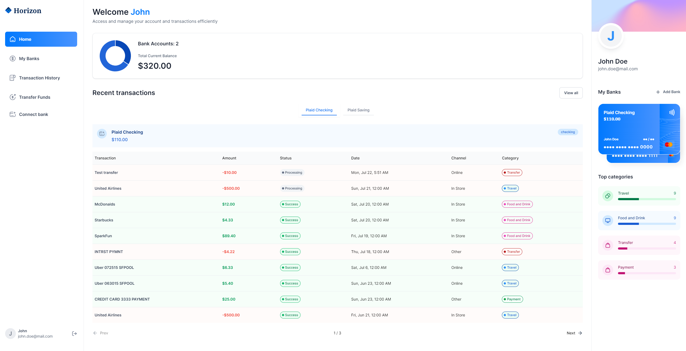
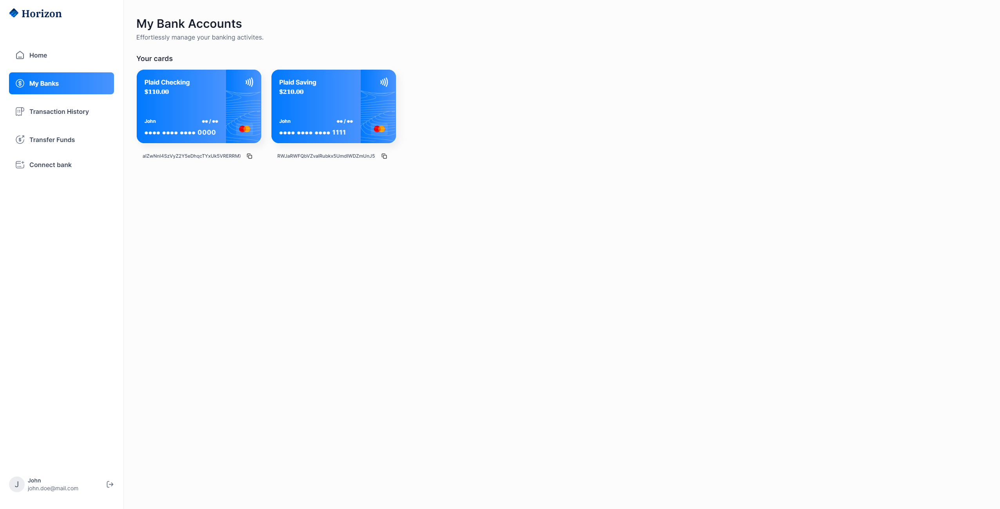
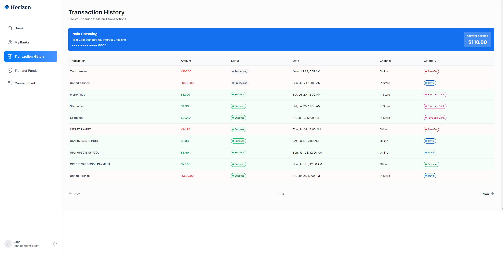
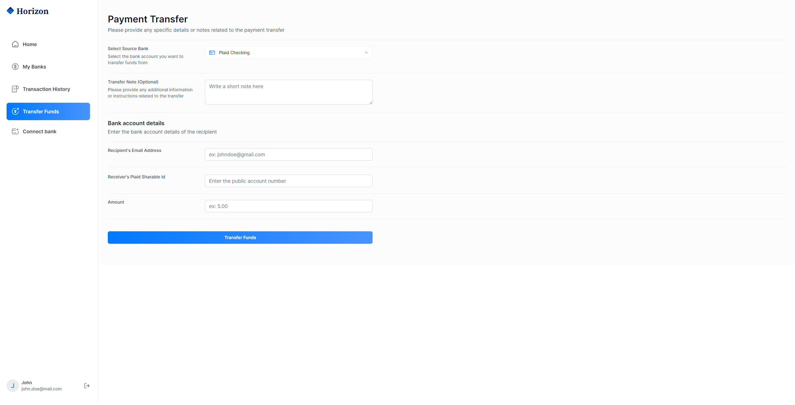
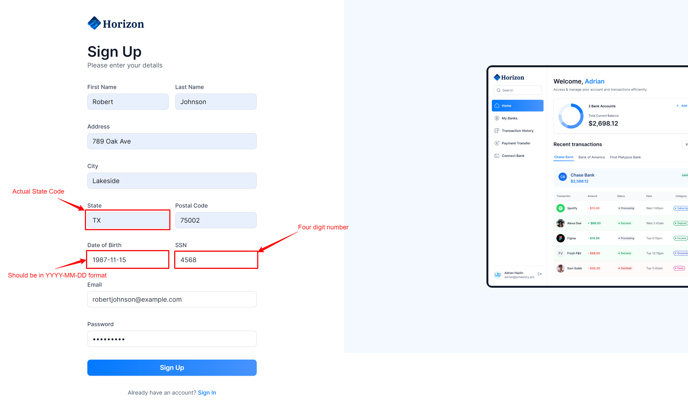
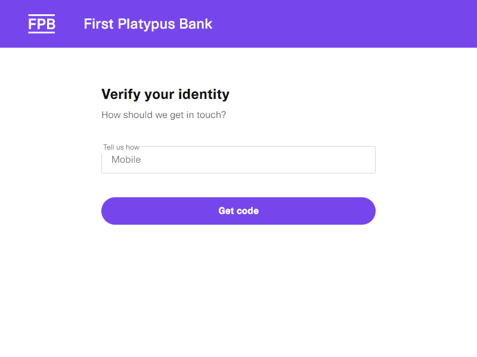
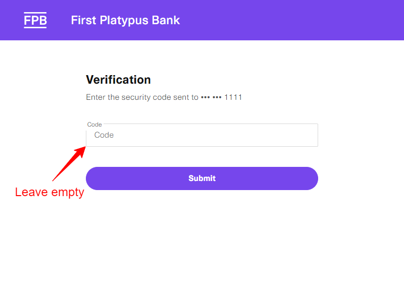

# Horizon - Bank/Budget App

Horizon is a full-fledged banking and budgeting application built using the latest NextJS. It leverages **[Appwrite](https://appwrite.io/)** for the backend services, **[Plaid](https://plaid.com/)** for bank communication, **[Dwolla](https://www.dwolla.com/)** for transaction handling, and **[Sentry](https://sentry.io/)** for monitoring issues. This README file serves as a guide to set up, configure, and understand the Horizon project.

> **A working demo can be found at: https://banking-nextjs-eight.vercel.app/**

## Features

- **Bank Account Integration:** Connects with Plaid to securely fetch and display bank account information.
- **Transaction Management:** Uses Dwolla to handle transactions such as deposits, withdrawals, and transfers.
- **Budget Tracking:** Allows users to set budgets, categorize transactions, and monitor expenses.
- **Secure Authentication:** Utilizes Appwrite for user authentication and session management.
- **Issue Monitoring:** Sentry is integrated for real-time error tracking and monitoring.
- **Responsive Design:** Built with Next.js to ensure a smooth and responsive user experience across devices.

## Prerequisites

Before setting up the Horizon project, ensure you have the following installed:

- Node.js (version >= 20.1.1)
- npm or yarn
- Appwrite backend server
- Plaid API credentials
- Dwolla API credentials
- Sentry account (for error monitoring)

## Getting Started

To get started with Horizon, follow these steps:

1. **Clone the Repository:**

   ```bash
   git clone https://github.com/your/repository.git
   cd horizon
   ```

2. **Install Dependencies:**

   ```bash
   npm install
   # or
   yarn install
   ```

3. **Configure Environment Variables:**

   Create a `.env` file in the root directory and add the following environment variables:

   ```makefile
   NEXT_PUBLIC_SITE_URL=

   #APPWRITE
   NEXT_PUBLIC_APPWRITE_ENDPOINT=https://cloud.appwrite.io/v1
   NEXT_PUBLIC_APPWRITE_PROJECT=
   APPWRITE_DATABASE_ID=
   APPWRITE_USER_COLLECTION_ID=
   APPWRITE_BANK_COLLECTION_ID=
   APPWRITE_TRANSACTION_COLLECTION_ID=
   NEXT_APPWRITE_KEY=

   #PLAID
   PLAID_CLIENT_ID=
   PLAID_SECRET=
   PLAID_ENV=
   PLAID_PRODUCTS=
   PLAID_COUNTRY_CODES=

   #DWOLLA
   DWOLLA_KEY=
   DWOLLA_SECRET=
   DWOLLA_BASE_URL=https://api-sandbox.dwolla.com
   DWOLLA_ENV=sandbox
   ```

   **_NOTE:_** Replace the values with your actual credentials.

4. **Run the Application:**

   ```bash
   npm run dev
   # or
   yarn dev
   ```

5. **Open Horizon in Your Browser:**

   Open your web browser and navigate to http://localhost:3000 to see Horizon in action.

## Deployment

To deploy Horizon for production, you can build the application and then host it using services like Vercel, Netlify, or your preferred hosting platform.

1. Build the Application:

   ```bash
   npm run build
   # or
   yarn build
   ```

2. Serve the Application:

   ```bash
   npm start
   # or
   yarn start
   ```

3. Configure Production Environment Variables:

   Make sure to set environment variables in your production environment similar to [`.env.example`](./.env.example) but ensure they are securely managed.

## Issue Monitoring with Sentry

Sentry is integrated into Horizon to help monitor and track issues in real-time. To view and manage issues:

- Log in to your Sentry account.
- Navigate to your project dashboard.
- Monitor and manage errors as they occur in your Horizon application.

## Contributing

Contributions are welcome! If you'd like to contribute to Horizon, please fork the repository and create a pull request with your proposed changes.

## License

This project is licensed under the MIT License - see the [LICENSE](./LICENSE) file for details.

## Acknowledgments

- Next.js - The React Framework
- Appwrite - Open Source Backend Server
- Plaid - API for Financial Services
- Dwolla - API for ACH Payments
- Sentry - Real-Time Error Tracking

Feel free to customize this README further to fit your project's specific details and branding. Happy coding with Horizon! 🌅

## Screenshots

1. **Dashboard**
   

2. **Bank Accounts**
   

3. **Transaction History**
   

4. **Transfer Funds**
   

## Testing Guide

Below are instructions for testing the Horizon prototype website. Please follow these steps to sign up and explore the functionalities integrated with Plaid's sandbox environment.

### Sign Up Process

#### 1. Account Registration:

- Fill out the signup form with accurate information. The form is straightforward, but ensure that fields are completed as per the placeholders provided.
- Sample user credentials that work:
  

#### 2. Linking to Plaid Sandbox Account:

- After signing up, you'll be prompted to link a bank account. This process is in a sandbox environment, so no real banking details are required.
- Select any bank from the list and proceed to log in.
- When prompted to log in to the **`First Platypus bank`**, use the following credentials:

  ```bash
  # Username
  user_good

  # Password
  pass_good
  ```

- For identity verification and account connection, follow the simulated steps as presented.
  
  

  > **Note:** Due to regional limitations (Europe or US), connection processes may vary in speed based on your location.

#### 3. Dashboard:

- Upon completing the setup with Plaid and Dwolla, you will be redirected to your dashboard.
- The dashboard will display simulated transactions and account balances for testing purposes.

### Important Notes

- **Prototype Status:** Horizon is a prototype with a primary focus on bank integration and transaction handling. Please be aware that there may be undiscovered issues, especially with form validations.

- **Support:** While I won't be actively maintaining this project, I appreciate your efforts in testing. Your feedback on issues encountered will be valuable for future development.
